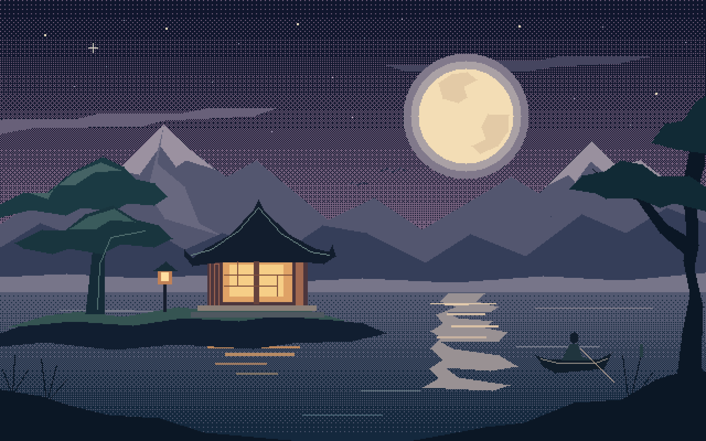

# 🎨 Pixelorama-MCP

> **For the ones who can imagine it but can't draw it.**

<p align="center">
  
</p>

**Pixelorama-MCP** is an official [Model Context Protocol (MCP)](https://modelcontextprotocol.io/) server that bridges AI assistants (Claude, Cursor, Antigravity, GPT, Gemini, Qwen, etc.) with [Pixelorama](https://www.pixelorama.org/), the free & open-source pixel art editor.

You describe what you want. The AI handles the rest — shapes, colours, shading, layers, animations, and full sprites — drawn live inside Pixelorama.

---

## ✨ Two Ways to Create

### 🤖 Way 1 — Describe it, AI draws it
Connect to Claude or any MCP client and describe your sprite in plain English:
> *"Draw a golden coin with a 3D star and drop shadow on a 64x64 canvas"*

The AI computes the geometry, shading, and outlines, then draws it pixel by pixel inside Pixelorama.

### 🖼️ Way 2 — Import any image as pixel art
Already have a reference image (AI-generated or hand-drawn)? Import it directly:
```bash
node docs/examples/import_universal_asset.js
```
The importer auto-detects the background, strips it out, and streams the pixel-perfect asset into Pixelorama with full transparency.

---

## 🗂️ Where to Start

| You want to… | Go here |
|---|---|
| Install & connect to Claude/Cursor | [Getting Started Guide](docs/getting-started.md) |
| Run a JS drawing script manually | [Custom Scripts Guide](docs/getting-started.md#manual-scripts) |
| Import an existing image into Pixelorama | [Image Import Guide](docs/getting-started.md#image-import) |
| See all available tools | [Tool Reference](docs/tool-reference.md) |
| Build or fix the Pixelorama plugin | [Plugin Setup](docs/plugin-setup.md) |
| Write an AI agent that draws | [Agentic Drawing Playbook](AGENTIC_DRAWING_PLAYBOOK.md) |
| See worked examples | [docs/examples/](docs/examples/) |

---

## 🏗️ Architecture

```
AI Client (Claude / Cursor / any MCP client)
        │  MCP — JSON-RPC over stdio
        ▼
   Pixelorama-MCP Server  (TypeScript / Node.js)
        │  HTTP REST — localhost:7373
        ▼
   Pixelorama Bridge Plugin  (GDScript)
        │  ExtensionsApi v8
        ▼
   Pixelorama v1.1.10
```

---

## ⚡ Quick Start

### Prerequisites
- [Node.js](https://nodejs.org/) ≥ 18
- [Pixelorama](https://www.pixelorama.org/) v1.1.10

### 1. Install the MCP server
```bash
git clone https://github.com/abidoo22/Pixelorama-MCP.git
cd Pixelorama-MCP/mcp-server
npm install && npm run build
```

### 2. Install the Pixelorama plugin
1. Open Pixelorama → **Edit → Preferences → Extensions**
2. Click **Add Extension** and select `pixelorama-plugin/PixMcpBridge.pck`
3. Enable it and restart Pixelorama

### 3. Connect Claude Desktop
Add to `claude_desktop_config.json`:
```json
{
  "mcpServers": {
    "pixelorama": {
      "command": "node",
      "args": ["/absolute/path/to/Pixelorama-MCP/mcp-server/dist/index.js"]
    }
  }
}
```

Then ask Claude: *"Create a 64×64 canvas and draw a shiny red apple with a drop shadow"*

---

## 🎮 Example Gallery

| Asset | Type | File / Description |
|---|---|---|
| 🏯 Moonlit Sanctuary | Showcase Landscape (3x) | [`moonlit_sanctuary_3x.png`](moonlit_sanctuary_3x.png) — Pixel-crisp 1920×1200 Japanese lakeside pagoda with full moon |
| 🐋 Leviathan at Dawn | Scenic Illustration | [`docs/examples/leviathan_dawn.png`](docs/examples/leviathan_dawn.png) — Celestial leviathan soaring through dawn clouds |
| 🏛️ Museum Gallery | Environmental Art | [`docs/examples/museum_gallery_2x.png`](docs/examples/museum_gallery_2x.png) — Spotlighted museum hall with framed art & sculpture |
| 🌆 Neo-Metropolis Overlook | Animated Panorama Banner | [`docs/examples/showcase_cyberpunk_banner.gif`](docs/examples/showcase_cyberpunk_banner.gif) — 192×64 animated cyberpunk city & cyber-ronin |
| 🌌 The Astral Drift | Animated Panorama Banner | [`docs/examples/showcase_astral_banner.gif`](docs/examples/showcase_astral_banner.gif) — 192×64 animated floating island with levitating mana crystal |
| 🦌 Sinister Wendigo Walk | Character Spritesheet | [`docs/examples/Sinister_Wendigo_Walk.png`](docs/examples/Sinister_Wendigo_Walk.png) — 8-frame walk cycle animation sheet |
| 🏰 Dungeon Tileset | Game Environment Tileset | [`docs/examples/dungeon_tileset_4x.png`](docs/examples/dungeon_tileset_4x.png) — Stone brick walls, water, lava, doors, spikes, & props |
| 🔬 Sci-Fi Lab Tileset | Prop & Furniture Sheet | [`docs/examples/ts_labs.png`](docs/examples/ts_labs.png) — Sci-fi consoles, containment tubes, server racks, & flooring |
| 💬 Retro Dialog Box | UI Component | [`docs/examples/dialog_box_2x.png`](docs/examples/dialog_box_2x.png) — RPG dialogue frame with corner ornaments & prompt cursor |
| 🪙 Golden Coin | Item Icon | [`docs/examples/coin.png`](docs/examples/coin.png) — Classic shaded 3D star golden coin with drop shadow |
| 🖼️ Universal Importer | Importer Utility | [`docs/examples/import_universal_asset.js`](docs/examples/import_universal_asset.js) — Pure Node.js script to strip background & stream into Pixelorama |

---

## 📖 Documentation

- [Getting Started](docs/getting-started.md) — Setup, prerequisites, client integration, and image import
- [Tool Reference](docs/tool-reference.md) — All 70 MCP tools with parameters and return formats
- [Plugin Setup](docs/plugin-setup.md) — Compiling the GDScript plugin, troubleshooting quarantine
- [Agentic Drawing Playbook](AGENTIC_DRAWING_PLAYBOOK.md) — Shading math, geometry recipes, and batch optimization for AI agents

---

## 🛠️ Development

```bash
cd mcp-server
npm install
npm run dev   # watch mode

# Test with MCP Inspector
npx @modelcontextprotocol/inspector node dist/index.js
```

---

## 🤝 Contributing

Contributions are welcome!

## 📄 License

[MIT](LICENSE) — go wild.

## 🙏 Credits

- [Pixelorama](https://www.pixelorama.org/) by Orama Interactive
- [Model Context Protocol](https://modelcontextprotocol.io/) by Anthropic
