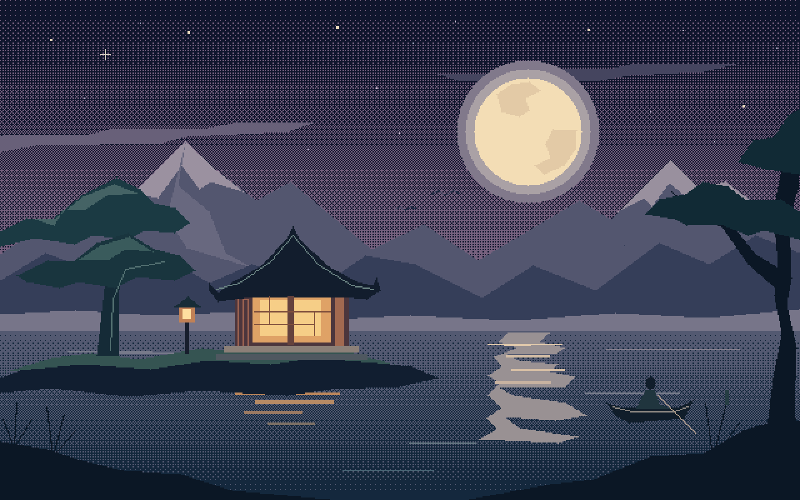
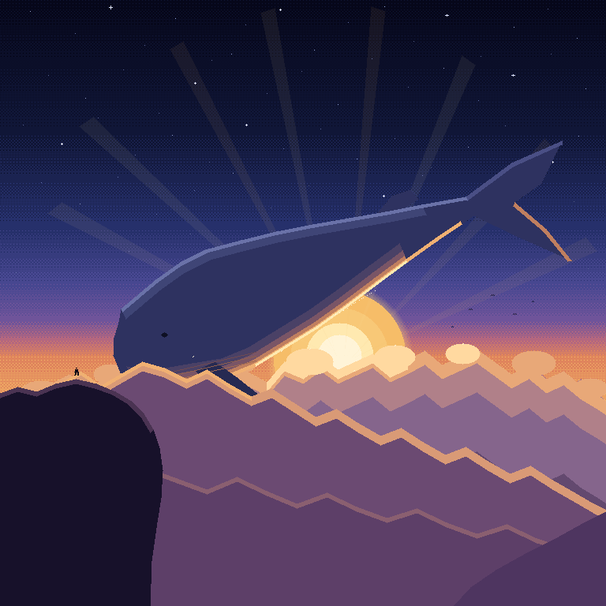
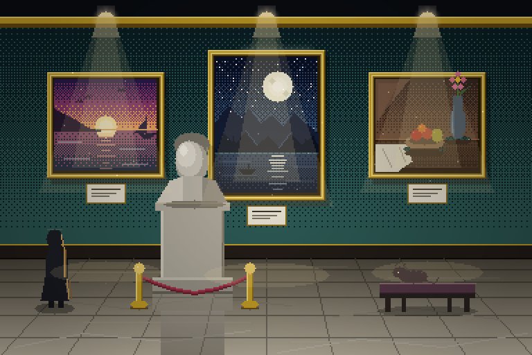
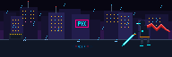
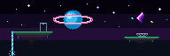
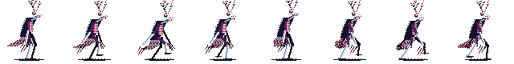
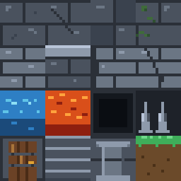
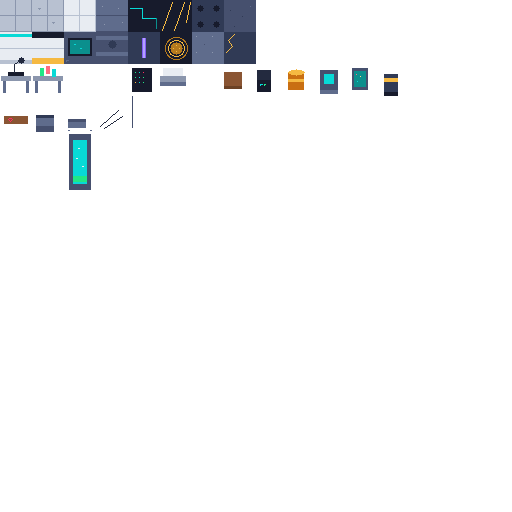
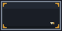

<div align="center">

# 🎨 Pixelorama-MCP

### Let AI draw pixel art directly inside [Pixelorama](https://www.pixelorama.org/).

**For the ones who can imagine it but can't draw it.**

[](LICENSE)
[](https://github.com/abidoo22/Pixelorama-MCP/stargazers)
[](https://modelcontextprotocol.io/)
[](https://www.pixelorama.org/)
[](https://nodejs.org/)
[-blue)](docs/tool-reference.md)



<sub><i>"Moonlit Sanctuary", painted live inside Pixelorama by an LLM via the Pixelorama-MCP toolset.</i></sub>

</div>

---

**Pixelorama-MCP** is an open-source [Model Context Protocol (MCP)](https://modelcontextprotocol.io/) server that seamlessly bridges AI assistants—including **Claude Desktop**, **Cursor**, **Google Antigravity**, **ChatGPT**, **Gemini**, **Qwen**, and custom autonomous agents—directly to **Pixelorama**, the free and open-source pixel art editor built on Godot Engine.

You describe your creative vision in natural language. The AI computes geometry, palettes, shading math, dithering, and layers, then draws them **live onto your Pixelorama canvas**. Everything created is a native Pixelorama project (`.pxo`) with complete undo history, layer hierarchies, and cel animations that you can continue editing by hand.

> **Note:** This is an independent open-source community project. It is not officially affiliated with or endorsed by Orama Interactive.

---

## 📑 Table of Contents

- [🚀 Key Capabilities](#-key-capabilities)
- [🎮 Example Gallery](#-example-gallery)
- [⚡ Quick Start](#-quick-start)
- [💬 Prompt Recipes & Ideas](#-prompt-recipes--ideas)
- [🖼️ Image Importer & Pixelizer](#️-image-importer--pixelizer)
- [🏗️ How It Works](#️-how-it-works)
- [🛠️ Toolset Overview](#️-toolset-overview)
- [🗂️ Documentation](#️-documentation)
- [🔧 Troubleshooting & FAQ](#-troubleshooting--faq)
- [🤝 Contributing](#-contributing)
- [📄 License](#-license)

---

## 🚀 Key Capabilities

- 🖌️ **Natural Language to Pixel Art:** Prompt sprites, UI panels, game assets, textures, and landscapes in plain English.
- ⚡ **Ultra-Fast Drawing Throughput:** Features `draw_pixels_fast` accepting flat coordinate/color arrays (`[x,y,col]` or `[x,y,r,g,b,a]`) running at **~0.02 ms/pixel**—over 100× faster than per-pixel roundtrips.
- ⚙️ **Direct GDScript Eval Hook (`eval_gdscript`):** Execute dynamic GDScript in-engine with cross-layer sampling (`api.get_layer_image`), bulk Image / buffer assignment, auto-fallback for `:=` type inference, and pinpoint line-number error reporting.
- 🧱 **Stable Layer Identifiers (`layer_id`):** Layer tools return persistent UUID handles, allowing safe layer targeting by ID, name, or index without index-shift corruption.
- 🌈 **Advanced Shading & Gradients:** Non-destructive radial and linear gradients with Bayer dithering, alpha blending (`blend: true`), elliptical falloff, smoothstep curves, and bloom glow.
- 📐 **Composition & Scene Planning (`generate_scene_plan`):** Generates horizon placement, rule-of-thirds focal points, value silhouettes, depth hierarchies, and layer plans for large scenes.
- 👁️ **Visual Inspection & Magnification:** `capture_canvas_image` supports custom bounding regions, downscaling (< 1.0) to save tokens, and nearest-neighbor magnification (up to 32×) for pixel-level multimodal visual inspection.
- 🎞️ **Animation & Cel Cloning:** Create walk cycles, frame tweens, onion skinning, and frame-rate configs with deep-cloning support.
- 📦 **Godot 4 Game Asset Pipeline:** Direct export to Godot 4 `SpriteFrames` (`.tres`), Godot 4 `TileSet`, APNG, GIF, and spritesheets.

---

## 🎮 Example Gallery

Every asset below was created by an AI agent communicating with Pixelorama through this MCP server:

<table>
  <tr>
    <td align="center" width="50%">
      <br>
      <b>🐋 Leviathan at Dawn</b><br><sub>Celestial leviathan soaring through dawn clouds</sub>
    </td>
    <td align="center" width="50%">
      <br>
      <b>🏛️ Museum Gallery</b><br><sub>Spotlit hall with framed art and a marble bust</sub>
    </td>
  </tr>
  <tr>
    <td align="center" width="50%">
      <br>
      <b>🌆 Neo-Metropolis Overlook</b><br><sub>192×64 animated cyberpunk city and cyber-ronin</sub>
    </td>
    <td align="center" width="50%">
      <br>
      <b>🌌 The Astral Drift</b><br><sub>192×64 floating island with a levitating mana crystal</sub>
    </td>
  </tr>
  <tr>
    <td align="center" width="50%">
      <br>
      <b>🦌 Sinister Wendigo Walk</b><br><sub>8-frame walk cycle spritesheet</sub>
    </td>
    <td align="center" width="50%">
      <br>
      <b>🏰 Dungeon Tileset</b><br><sub>Stone walls, water, lava, doors, spikes, and props</sub>
    </td>
  </tr>
  <tr>
    <td align="center" width="50%">
      <br>
      <b>🔬 Sci-Fi Lab Tileset</b><br><sub>Consoles, containment tubes, server racks, flooring</sub>
    </td>
    <td align="center" width="50%">
      <br>
      <b>💬 Retro Dialog Box</b><br><sub>RPG dialogue frame with ornaments and a prompt cursor</sub>
    </td>
  </tr>
  <tr>
    <td align="center" colspan="2">
      <br>
      <b>🪙 Golden Coin</b><br><sub>Classic shaded 3D star coin with a drop shadow</sub>
    </td>
  </tr>
</table>

---

## ⚡ Quick Start

Setting up takes under 5 minutes.

### Prerequisites

- [Node.js](https://nodejs.org/) (v18 or newer)
- [Pixelorama](https://www.pixelorama.org/) (**v1.1.10** or **v1.2+**)
- An MCP Client: [Claude Desktop](https://claude.ai/download), [Cursor](https://cursor.com/), [Antigravity](https://github.com/), or any MCP-compatible environment

### 1. Clone & Build the MCP Server

```bash
git clone https://github.com/abidoo22/Pixelorama-MCP.git
cd Pixelorama-MCP/mcp-server
npm install
npm run build
```

### 2. Install the Bridge Extension in Pixelorama

1. Open Pixelorama and navigate to **Edit → Preferences** (`Ctrl+,`) → **Extensions**.
2. Click **Add Extension** and select `pixelorama-plugin/PixMcpBridge.pck` (or download it from Releases).
3. Ensure the extension is **Enabled**, then **restart Pixelorama**.
4. The bridge will listen locally on `http://127.0.0.1:7373`. You can verify by opening:
   ```bash
   curl http://127.0.0.1:7373/health
   # Returns: {"status":"ok","server":"pix-mcp-bridge","pixelorama_version":"...","api_version":9}
   ```

### 3. Connect Your MCP Client

#### Claude Desktop

Add this entry to your `claude_desktop_config.json`:
- **macOS:** `~/Library/Application Support/Claude/claude_desktop_config.json`
- **Linux:** `~/.config/Claude/claude_desktop_config.json`
- **Windows:** `%APPDATA%\Claude\claude_desktop_config.json`

```json
{
  "mcpServers": {
    "pixelorama": {
      "command": "node",
      "args": [
        "--max-old-space-size=4096",
        "/absolute/path/to/Pixelorama-MCP/mcp-server/dist/index.js"
      ]
    }
  }
}
```

#### Cursor IDE

1. Open Cursor **Settings → Features → MCP Servers**.
2. Click **Add New MCP Server**.
3. Set **Name** to `pixelorama`, **Type** to `command`.
4. Set **Command** to: `node --max-old-space-size=4096 /absolute/path/to/Pixelorama-MCP/mcp-server/dist/index.js`

Now restart your AI client, open Pixelorama, and give it your first drawing prompt!

---

## 💬 Prompt Recipes & Ideas

Try pasting any of these prompts into your connected AI:

| Purpose | Example Prompt |
|---|---|
| **RPG Item Icon** | *"Draw a 64×64 golden dragon amulet with an emerald gemstone core, metallic bevel highlights, and a soft drop shadow."* |
| **Character Sprite** | *"Create a 32×32 pixel art necromancer character with purple robes, glowing cyan eyes, and a magical staff."* |
| **Animation Loop** | *"Make a 4-frame 32×32 idle breathing animation for a slime monster with smooth squash and stretch."* |
| **Landscape / Scene** | *"Paint a 320×180 atmospheric night scene: a pine forest silhouette, distant aurora borealis with radial glow, and a moonlit lake reflection."* |
| **Game Tileset** | *"Create a 16×16 top-down dungeon tileset on separate layers: cobble floor, cracked stone wall, wooden chest, and an iron dungeon door."* |
| **Procedural Scripting** | *"Use eval_gdscript to generate a 64×64 cellular automata cave map with rocky walls and mossy ground."* |

> 💡 **Tip:** Mentioning light sources (*"top-left lighting"*), palettes (*"PICO-8"* or *"Game Boy 4-color"*), and resolution gives sharper, more cohesive art.

---

## 🖼️ Image Importer & Pixelizer

Turn any reference image or AI-generated photo into transparent pixel art:

```bash
node docs/examples/import_universal_asset.js
```

The smart asset importer automatically detects solid or gradient backgrounds, extracts the foreground subject, snaps pixels to grid dimensions, and streams the asset straight into Pixelorama.

---

## 🏗️ How It Works

```
┌─────────────────────────────────────────────────────────┐
│        AI Assistant (Claude / Cursor / Antigravity)      │
└──────────────────────────┬──────────────────────────────┘
                           │  JSON-RPC over stdio (MCP)
                           ▼
┌─────────────────────────────────────────────────────────┐
│             Pixelorama-MCP Server (Node.js)             │
│   • Schema Coercion & Validation (Zod)                  │
│   • Mathematical Color & Geometry Helpers               │
│   • Dynamic GDScript Runtime Wrapper                    │
└──────────────────────────┬──────────────────────────────┘
                           │  HTTP REST (localhost:7373)
                           ▼
┌─────────────────────────────────────────────────────────┐
│        PixMcpBridge Plugin (GDScript / Godot 4)         │
│   • UndoRedo Integration (Full History & Reversible)    │
│   • Engine-Speed Flat Buffer Rasterization (0.02ms/px)  │
│   • ExtensionsApi Integration (Layers, Frames, Cels)    │
└──────────────────────────┬──────────────────────────────┘
                           │
                           ▼
┌─────────────────────────────────────────────────────────┐
│            Pixelorama Pixel Art Editor Canvas           │
└─────────────────────────────────────────────────────────┘
```

All communication occurs locally via `127.0.0.1:7373`. No canvas data is transmitted externally outside your local machine.

---

## 🛠️ Toolset Overview

Pixelorama-MCP exposes over 70 tools organized by domain:

### 1. Canvas & Project Management
- `create_canvas`: Initialize new projects with custom width, height, and fill.
- `list_canvases` / `switch_canvas` / `close_canvas`: Multi-tab project workspace management.
- `crop_to_content`: Trim empty borders without clipping cels or losing coordinate alignment.
- `scale_canvas`: Upscale/downscale projects with nearest-neighbor scaling.
- `fit_viewport`: Center and scale the active viewport onto the canvas.

### 2. High-Performance Drawing
- `draw_pixels_fast`: High-throughput flat array drawer (`[x,y,col]` or `[x,y,r,g,b,a]`) executing at 0.02 ms/px.
- `draw_pixels`: Batch drawing of pixel arrays in a single atomic undoable action.
- `draw_rect`, `draw_ellipse`, `draw_line`, `draw_polygon`, `draw_path`: Primitive rasterizers with explicit `alpha` and `blend` support.
- `fill_area`: Flood fill algorithm with 8-direction adjacency and color tolerance.
- `draw_text`: Render crisp bitmap typography directly onto pixel cels.

### 3. Layer System & Organization
- `add_layer` / `delete_layer`: Create and delete layers, returning persistent `layer_id` handles.
- `get_layers`: Inspect layer hierarchy, blend modes, opacity, and IDs.
- `set_layer_opacity` / `set_layer_blend_mode` / `set_layer_visibility`: Control compositing.
- `duplicate_layer` / `merge_layers` / `reorder_layers`: Non-destructive layer management.

### 4. Shading & Procedural FX
- `apply_gradient`: Linear and radial gradients with Bayer dithering, elliptical shapes, bloom falloff, and alpha preservation.
- `apply_glow`: Neon and magical bloom generation on active layer or dedicated additive glow layer.
- `apply_drop_shadow`: Cast silhouette drop shadows with configurable offsets and opacity.
- `eval_gdscript`: Execute dynamic GDScript code in-engine on canvas images with full engine API access.

### 5. Color, Palettes & Diagnostics
- `get_palette_usage`: Bounded color frequency histogram (`top: N`) with total unique count.
- `color_replace` / `adjust_hsv`: Non-destructive hue shifting, saturation adjustment, and recoloring.
- `clean_isolated_pixels`: Remove stray single-pixel noise.
- `check_seamless_tile`: Validate and auto-stitch repeating tile wrap seams.

### 6. Animation & Frames
- `add_frame`, `duplicate_frame`, `delete_frame`, `switch_frame`: Frame sequencing.
- `copy_cel`, `clear_cel`, `tween_cel`: Cel operations with reversible undo integration.
- `set_fps` / `set_frame_duration`: Playback configuration.

### 7. Export & Game Engine Integration
- `export_image` (PNG), `export_gif`, `export_apng`, `export_aseprite_json`.
- `export_godot_spriteframes`: Ready-to-use Godot 4 `SpriteFrames` resource (`.tres`).
- `export_godot_tileset`: Ready-to-use Godot 4 `TileSet` resource.

See the full [Tool Reference](docs/tool-reference.md) for argument tables and JSON examples.

---

## 🗂️ Documentation

- 📖 [Getting Started Guide](docs/getting-started.md) — Step-by-step installation and client setup.
- 🛠️ [Tool Reference](docs/tool-reference.md) — Exhaustive documentation of all tools and schemas.
- 🎨 [Agentic Drawing Playbook](AGENTIC_DRAWING_PLAYBOOK.md) — Shading rules, color ramps, geometry recipes, and batching tricks for LLM agents.
- 🔌 [Plugin Setup & Compilation](docs/plugin-setup.md) — Building and packing the `.pck` file with Godot Engine.
- 📂 [Example Scripts](docs/examples/) — Scripts demonstrating asset imports, banners, and tilesets.

---

## 🔧 Troubleshooting & FAQ

#### The AI client cannot see the tools
- Ensure you ran `npm run build` inside `mcp-server/`.
- Verify the path in your client configuration is an **absolute path** to `mcp-server/dist/index.js`.
- Fully restart your AI client after editing configuration.

#### Pixelorama is open, but commands time out
- Verify that `PixMcpBridge.pck` is enabled under **Edit → Preferences → Extensions**.
- Check that Pixelorama was restarted after enabling the extension.
- Test `curl http://127.0.0.1:7373/health` to confirm the local port is reachable.

#### Which AI models produce the best art?
- Models with strong spatial reasoning and mathematical capability (such as Claude 3.5 Sonnet, Claude 3.7 Sonnet, GPT-4o, and Gemini 1.5 Pro) produce remarkable shading, dithering, and composition.

---

## 🤝 Contributing

Contributions are warmly welcome! Whether you want to add new procedural drawing tools, improve Godot integration, or submit artwork prompts:

1. Fork the repository and create a feature branch (`git checkout -b feature/awesome-tool`).
2. Make your edits and ensure tests pass (`node test_all_fixes.js`).
3. Submit a Pull Request with a clear description of the enhancement.

---

## 📄 License

Pixelorama-MCP is released under the [MIT License](LICENSE).

---

## 🙏 Credits & Acknowledgments

- [Pixelorama](https://www.pixelorama.org/) — Created by Orama Interactive and the open-source community.
- [Godot Engine](https://godotengine.org/) — The powerhouse game engine behind Pixelorama.
- [Model Context Protocol](https://modelcontextprotocol.io/) — Created by Anthropic.

---

<div align="center">
<sub><b>Search Keywords:</b> Pixelorama MCP, Model Context Protocol, Pixel Art AI, Claude Pixel Art, Cursor MCP Pixel Art, Godot Pixel Art, AI Sprite Generator, Pixel Art LLM, Prompt to Pixel Art, Procedural Pixel Art GDScript.</sub>
</div>
